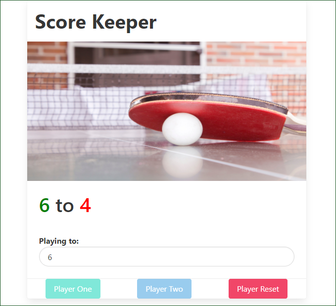

# Score Keeper
This app uses Vanilla JavaScript to manipulate the DOM - Document Object Module and Keep a Score of a Ping Pong Game (or other multiplayer game).

## Tech/framework used
* JavaScript
* Bulma - CSS Framework

## Features
* Score Keeper
* Reset

## Installation 
* Download the repository
* Open index.html
